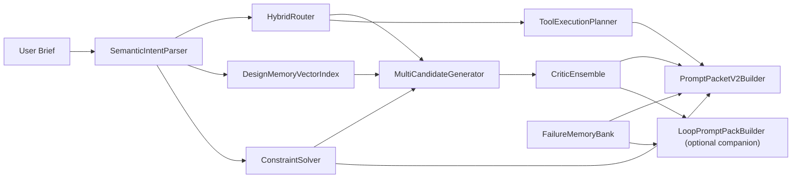

# DESIGNOSFORGE v2.0 Architecture Blueprint

DESIGNOSFORGE v2.0 upgrades the system from prompt governance to a mathematical design kernel. The new LoopPromptPack module is developed as an independent companion protocol, not as a replacement for PromptPacketV2.

## Core Pipeline



## Mathematical Layer

`app/core/design_math.py` provides dependency-free algorithms:

- `TextVectorizer`: Latin word features plus Chinese character, bigram, and trigram features.
- `cosine` and `jaccard`: mixed-language similarity scoring.
- `ScoreNormalizer.softmax`: route probability normalization.
- `ScoreNormalizer.entropy`: uncertainty measurement for routing.
- `ScoreNormalizer.confidence`: confidence from probability margin and entropy.
- `pareto_front`: non-dominated candidate detection.
- `topsis_rank`: candidate closeness to ideal design objectives.
- `MultiObjectiveRanker`: weighted utility + TOPSIS + Pareto front.
- `ConstraintPenaltyModel`: residual risk from risk load, context complexity, and mitigation strength.

## Route Model

`HybridRouter` combines:

- keyword hits from local task routes
- vector similarity between the brief and route vocabulary
- domain priors
- project-context priors
- forced safety routes for CAD source fidelity and photography identity preservation

The route output includes raw scores, softmax probabilities, entropy, probability margin, and confidence.

## Memory Model

`DesignMemoryVectorIndex` scores memory cases with:

```text
memory_score =
  0.42 * cosine_similarity
+ 0.12 * jaccard_similarity
+ 0.31 * taxonomy_similarity
+ 0.15 * taxonomy_prior
```

This prevents Chinese briefs from collapsing to zero similarity when captions are English, while still respecting domain, project context, and style axis.

## Constraint Model

`ConstraintSolver` generates hard constraints, soft goals, and risk controls. The penalty vector exposes:

- `risk_load`
- `mitigation_strength`
- `domain_complexity`
- `context_complexity`
- `generic_penalty`
- `hard_constraint_load`
- `specificity_score`
- `residual_risk`
- `constraint_satisfaction`

For CAD workflows, geometry locks are injected before aesthetics. For photography, identity and light locks are injected before retouching. For city identity, grid derivation and dynamic submark systems are required to avoid generic landmark stacking.

## Candidate Model

`MultiCandidateGenerator` ranks directions with these objectives:

- `domain_fit`
- `constraint_fit`
- `memory_fit`
- `clarity`
- `risk_control`
- `novelty`

Ranking combines normalized weighted utility, TOPSIS closeness, and Pareto-front membership.

## Critic Model

`CriticEnsemble` aggregates:

- `AestheticCritic`
- `DomainCritic`
- `ConstraintCritic`
- `CandidateCritic`
- `MemoryCritic`
- optional `TextCritic`
- optional `IdentityCritic`
- final `KernelAggregateCritic`

The aggregate score uses weighted normalized scores so feedback is inspectable.

## LoopPromptPack

`app/core/loop_prompt.py` adds an independent LoopPromptPack scheme. It is not a replacement for PromptPacketV2. It is a companion output used when a brief asks for loop, iteration, failed-result recovery, branch exploration, visual-result repair, or seamless video-loop prompting.

LoopPromptPack provides:

- loop activation scoring and trigger hits
- loop type selection: self-refine, design critic, failure memory, branch search, visual result repair, or seamless video loop
- iteration state schema
- critique axes and revision axes
- stop conditions
- stage prompts for draft, critique, revision, and stop checks
- export policy for standalone JSON or attachment beside PromptPacketV2

PromptPacketV2 remains the main design contract. LoopPromptPack is exposed as `loop_prompt_pack` in `DesignKernelPlan` and through the CLI action `kernel loop-prompt`.

## CLI

```powershell
py -m app.cli kernel plan "为安徽省钢城马鞍山市设计城市标识系统logo，要求现代、公共文化传播、不要堆砌地标"
py -m app.cli kernel prompt-packet "用CADMCP审核环艺DWG平面并生成展板分析图提示词"
py -m app.cli kernel loop-prompt "create a design prompt with three loop iterations and self critique"
py -m app.cli kernel loop-prompt "generate a seamless loop video prompt; first and last frame must match"
py -m app.cli kernel math-audit "拯救课堂纪实照片，不要改变人物本来的面貌形象"
```
